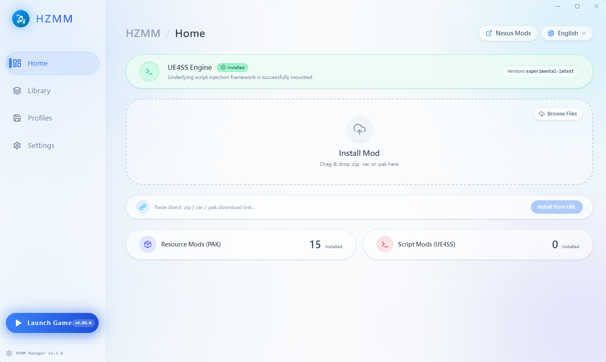
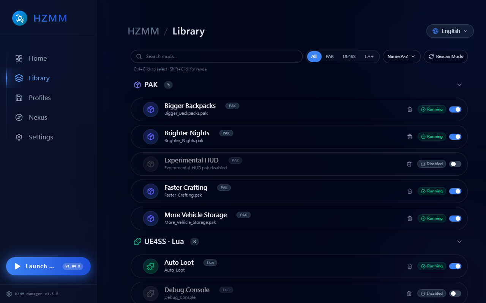
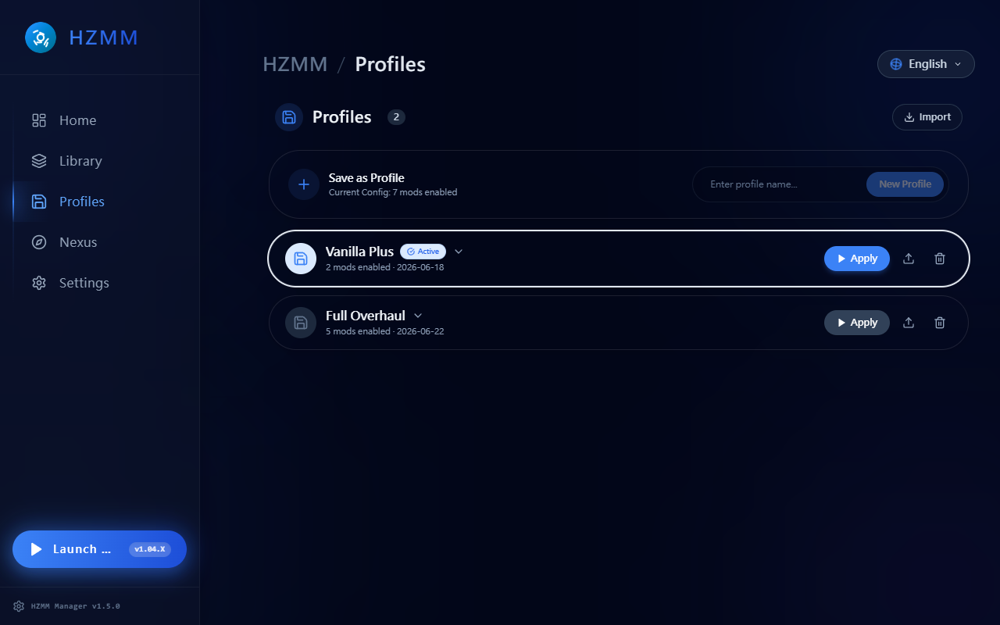
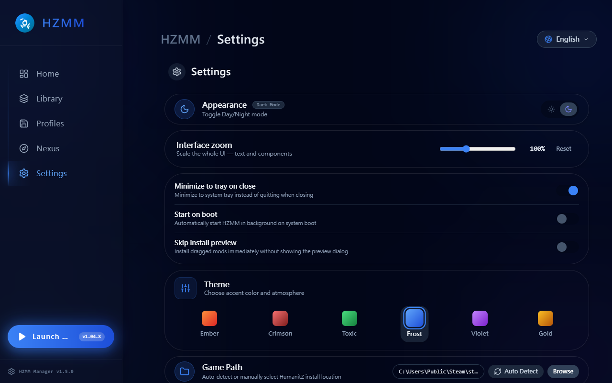

<p align="center">
  
</p>

<h1 align="center">HZMM Manager</h1>

<p align="center">
  <strong>HumanitZ Mod Manager</strong> — A modern desktop app for managing HumanitZ game mods.
</p>

<p align="center">
  <a href="https://github.com/uuuu790/HZMM/releases/latest">
    
  </a>
  
  
</p>

---

## Features

### Mod Management
- **One-click install** — Drag & drop `.zip`, `.rar`, or `.pak` files to install mods instantly
- **PAK & UE4SS support** — Manage both resource mods (PAK) and script mods (UE4SS Lua/C++)
- **Inline rename** — Click any mod name to give it a custom display name
- **Mod conflict detection** — Scans PAK file indexes to detect resource-level conflicts between mods
- **Profile system** — Save and switch between mod configurations with one click

### Config Editor
- **Visual schema editor** — Auto-detected toggles, sliders, color pickers, keybinds, multi-select, string lists, and unified dropdowns ([schema spec](docs/CONFIG.md))
- **Cross-key search** — Filter large schemas instantly across sections and descriptions
- **Reset to defaults** — One-click revert per section or whole schema
- **Section-aware collapse** — Large schemas fold by section to stay navigable
- **Multi-language descriptions** — Config copy follows the app language
- **Description tokens** — `{value}` interpolation in descriptions for live previews

### Nexus Mods Integration
- **In-app browser** — Browse, search, sort (Trending / Added / Updated / Downloaded) without leaving the app
- **No-key browsing** — API key only required to install; browsing works anonymously
- **Multi-file picker** — Pick the exact file variant when a mod ships multiple downloads
- **Installed badge** — Cards and detail modal show which Nexus mods you already have
- **Per-file install state** — Tracks which specific file you installed, not just the mod
- **Persistent install tracking** — Survives reinstall and rename

### Engine & Game
- **UE4SS engine management** — Auto-deploy and update the UE4SS scripting framework
- **Game detection** — Auto-detects HumanitZ install path via Steam registry
- **Game running alert** — Warns you before modifying files while the game is running

### Backup & Update
- **World save backup** — Backup world saves with mod snapshot, restore anytime
- **Auto-update** — Checks GitHub for new releases, downloads and replaces in-place
- **Startup update pill** — Non-intrusive update notice on launch; opt-in "skip install preview" for fast updates

### User Experience
- **Splash screen** — Animated startup screen with logo and loading indicator
- **Multi-language** — 繁體中文, English, 日本語, 한국어, Русский, Deutsch, Français
- **6 theme presets** — Ember, Crimson, Toxic, Frost, Violet, Gold with Dark / Light mode
- **Logging** — All operations logged to `%APPDATA%/hzmm-manager/hzmm.log`

## Screenshots

<table>
  <tr>
    <td align="center" width="50%"><strong>Dashboard</strong><br></td>
    <td align="center" width="50%"><strong>Library</strong><br></td>
  </tr>
  <tr>
    <td align="center" width="50%"><strong>Profiles</strong><br></td>
    <td align="center" width="50%"><strong>Settings</strong><br></td>
  </tr>
</table>

## Download

Download the latest portable `.exe` from [Releases](https://github.com/uuuu790/HZMM/releases/latest). No installation required — just run it.

## Tech Stack

| Layer | Technology |
|-------|------------|
| Framework | [Electron](https://www.electronjs.org/) 42 |
| Frontend | [React](https://react.dev/) 18 + [Tailwind CSS](https://tailwindcss.com/) 4 |
| Build | [electron-vite](https://electron-vite.org/) 5 + [electron-builder](https://www.electron.build/) 26 |
| Archive | [node-stream-zip](https://github.com/nicow22/node-stream-zip) + [node-unrar-js](https://github.com/nicow22/node-unrar-js) |
| Icons | [Lucide React](https://lucide.dev/) |

## Project Structure

```
src/
├── main/                   # Electron main process
│   ├── index.js            # App entry, window creation, IPC registration
│   ├── ipc/                # IPC handlers
│   │   ├── mods.js                  # Mod IPC registration + custom names
│   │   ├── mods-scan.js             # Mod scanning with in-memory cache
│   │   ├── mods-install.js          # Archive extraction & mod installation
│   │   ├── mods-config.js           # Per-mod config read / write
│   │   ├── mods-profiles.js         # Profile save / load / switch
│   │   ├── mods-readme.js           # Mod README discovery & rendering
│   │   ├── mods-registry.js         # UE4SS mods.txt / mods.json registry
│   │   ├── mods-download.js         # Direct download helpers
│   │   ├── nexus.js                 # Nexus Mods IPC surface
│   │   ├── nexus-v2-client.js       # Nexus v2 GraphQL client
│   │   ├── nexus-cache.js           # Nexus response cache
│   │   ├── nexus-install-tracker.js # Per-file installed-state tracking
│   │   ├── game.js                  # Game path detection, launch, running check
│   │   ├── ue4ss.js                 # UE4SS engine deploy & update
│   │   ├── settings.js              # Settings, file dialogs, shell commands
│   │   ├── locale.js                # Multi-language support
│   │   ├── saves.js                 # World save backup & restore
│   │   ├── app-update.js            # Auto-update check, download, install
│   │   ├── conflicts.js             # Mod conflict detection
│   │   └── constants.js             # IPC-side shared constants
│   └── services/           # Business logic
│       ├── archive.js          # ZIP/RAR extraction, mod type analysis
│       ├── config-store.js     # JSON config persistence
│       ├── path-safety.js      # isPathWithin / resolveWithin (zip-slip guard)
│       ├── steam-detector.js   # Steam path & game detection
│       ├── github-release.js   # UE4SS GitHub release fetcher
│       ├── app-updater.js      # App update checker & downloader
│       ├── pak-parser.js       # UE4 PAK binary index reader
│       ├── process-detector.js # Game process detection
│       ├── readme-utils.js     # README markdown helpers
│       └── logger.js           # File logger with rotation
├── preload/
│   └── index.js            # Context bridge (API exposure to renderer)
└── renderer/
    └── src/
        ├── App.jsx         # Main UI component
        ├── main.jsx        # React entry point
        ├── index.css       # Global styles
        ├── constants/
        │   └── i18n/       # Per-language string tables (de, en, fr, ja, ko, ru, zh-TW)
        ├── hooks/          # Custom React hooks
        │   ├── useToast.js          # Toast notification system
        │   ├── useConfirmModal.js   # Confirmation dialog state
        │   ├── useTheme.js          # Theme & dark mode management
        │   ├── useAppInit.js        # Game, UE4SS, conflict init
        │   ├── useModHandlers.jsx   # Mod CRUD operations
        │   ├── useBackupHandlers.js # Backup & restore
        │   ├── useProfileHandlers.js # Profile management
        │   ├── useUpdateHandlers.js # Auto-update
        │   └── profile-utils.js     # Profile diff / merge helpers
        └── components/
            ├── layout/     # App shell (Sidebar, AppHeader)
            ├── common/     # Shared UI primitives (GlassCard, Spinner, Toast, NexusModCard, ...)
            ├── tabs/       # Page-level views (Dashboard, Modules, Nexus, Profiles, Settings)
            └── modals/     # Dialog overlays
                └── config-editor/  # Schema renderer + per-type widgets (slider, color, keybind, ...)

tests/
├── services/               # Unit tests for main/services
│   ├── path-safety.test.js     # isPathWithin / resolveWithin — zip-slip & traversal
│   ├── archive.test.js         # isSafePath, analyzeArchiveStructure
│   ├── app-updater.test.js     # compareVersions, version parsing
│   └── process-detector.test.js # Game process detection
├── ipc/                    # Unit tests for main/ipc pure helpers
│   ├── mods-config-path.test.js  # resolveModConfigPath — modFilename traversal
│   ├── mods-config.test.js       # Config read / write + section-aware schema lookup
│   ├── mods-download.test.js     # Download URL validation
│   ├── mods-install.test.js      # findUe4ssFolders, mod type detection
│   ├── mods-registry.test.js     # mods.txt / mods.json sync & removal
│   ├── mods-scan.test.js         # Cache invalidation & rescan
│   ├── mods-allowed-hosts.test.js # Allowlist enforcement for outbound URLs
│   ├── conflicts.test.js         # PAK conflict detection
│   ├── settings.test.js          # Settings persistence + autofill race fix
│   └── app-update.test.js        # Update check & download
├── renderer/
│   ├── i18n-completeness.test.js # All 7 languages have matching keys
│   ├── config-parser.test.js     # Schema parsing
│   ├── config-search.test.js     # Cross-key search
│   ├── profile-utils.test.js     # Profile diff / merge
│   └── bbcode.test.js            # Nexus BBCode → HTML renderer
└── audit-regression.test.js  # Regression guard from `npm run audit`

e2e/                        # Playwright E2E tests (Electron)
├── drag-drop.spec.mjs      # Drag & drop synthetic events
├── buttons-smoke.spec.mjs  # Sidebar / header / tab button smoke
├── all-buttons.spec.mjs    # Exhaustive button reachability sweep
└── config-editor.spec.mjs  # Config editor modal flows
```

## Development

### Prerequisites

- [Node.js](https://nodejs.org/) 18+
- [npm](https://www.npmjs.com/) 9+

### Setup

```bash
git clone https://github.com/uuuu790/HZMM.git
cd HZMM
npm install
```

### Run in dev mode

```bash
npm run dev
```

### Build portable exe

```bash
npm run package
```

Output: `dist/HZMM Manager {version}.exe`

### Testing

410 unit tests (Vitest) + 18 E2E tests (Playwright).

```bash
npm run test          # unit tests (one-shot)
npm run test:watch    # unit tests (watch mode)
npm run test:e2e      # E2E tests (requires built Electron app)
npm run check         # audit + lint + unit tests in one shot
```

Unit tests live in `tests/` and target pure helpers. E2E tests live in `e2e/` and launch the real Electron app. Any new IPC handler that builds a filesystem path from renderer input **must** use `resolveWithin` from `services/path-safety.js` and ship with a traversal test.

### Linting

```bash
npm run lint          # report
npm run lint:fix      # auto-fix safe rules
```

Main process and preload code run under Node/Electron rules via `eslint-plugin-n`. Renderer runs under `eslint-plugin-react` + `react-hooks`. A custom rule bans `child_process.exec` with template literals — use `spawn` with an argv array instead.

## License

All rights reserved.
