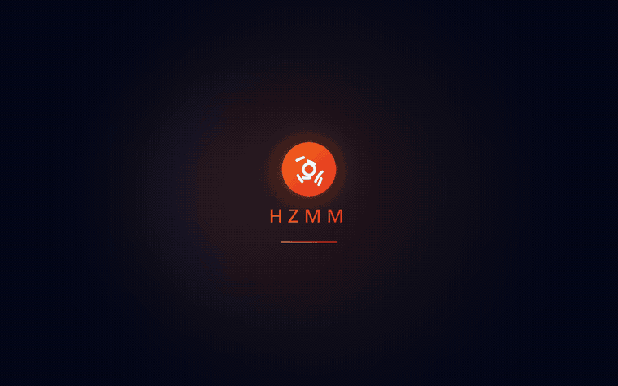

<p align="center">
  
</p>

<h1 align="center">HZMM Manager</h1>

<p align="center">
  <strong>HumanitZ 的一站式模組管理器。</strong><br>
  安裝、設定、整理你的所有 mod —— 全程不用碰遊戲資料夾。
</p>

<p align="center">
  <a href="https://github.com/uuuu790/HZMM/releases/latest">
    
  </a>
  <a href="https://github.com/uuuu790/HZMM/releases">
    
  </a>
  
  
  
</p>

<p align="center">
  <a href="README.md">English</a> · <strong>繁體中文</strong>
</p>

<p align="center">
  
</p>

---

## 目錄

- [為什麼用 HZMM？](#為什麼用-hzmm)
- [功能](#功能)
- [畫面截圖](#畫面截圖)
- [開始使用](#開始使用)
- [常見問題](#常見問題)
- [技術棧](#技術棧)
- [專案結構](#專案結構)
- [開發](#開發)
- [授權](#授權)

## 為什麼用 HZMM？

幫 HumanitZ 裝 mod，通常代表你得手動搬 `.pak` 檔、到處找正確的安裝資料夾、用文字編輯器改設定檔，還要祈禱兩個 mod 不會打架。**這些 HZMM 都幫你做好了。**

- **丟檔即裝。** 不用再手動翻資料夾 —— HZMM 自動辨識 mod 類型並裝到正確位置。
- **視覺化改設定。** 用 toggle、slider、調色盤取代直接編輯純文字設定檔。
- **不離開 App 就能逛 Nexus。** 在同一個視窗找 HumanitZ mod 並安裝。
- **遊戲壞掉前先攔住衝突。** HZMM 掃描資源衝突，提前警告你。

一個精緻的桌面 App —— 沒有指令列、不用瞎猜。

## 功能

### 🧩 模組管理
- **一鍵安裝** —— 拖放 `.zip`、`.rar`、`.pak` 檔即可立即安裝 mod
- **PAK 與 UE4SS 支援** —— 同時管理資源型 mod（PAK）與腳本型 mod（UE4SS Lua/C++）
- **行內重新命名** —— 點任一 mod 名稱即可設定自訂顯示名稱
- **衝突偵測** —— 掃描 PAK 檔索引，偵測 mod 之間的資源層級衝突
- **設定檔系統（Profile）** —— 一鍵儲存、切換與**分享**不同的 mod 組合；匯入時自動下載你缺少的 Nexus mod

### ⚙️ 設定編輯器
- **視覺化 schema 編輯器** —— 自動偵測 toggle、slider、調色盤、按鍵綁定、多選、字串清單與下拉選單（[schema 規格](docs/CONFIG_SCHEMA.md)）
- **跨欄位搜尋** —— 在大型 schema 中即時跨區段與描述篩選
- **重設為預設值** —— 單一區段或整份 schema 一鍵還原
- **依區段折疊** —— 大型 schema 依區段收合，維持可瀏覽性
- **多語言描述** —— 設定說明文字跟隨 App 語言
- **描述變數** —— 描述中可用 `{value}` 內插做即時預覽

### 🌐 Nexus Mods 整合
- **App 內瀏覽器** —— 不離開 App 即可瀏覽、搜尋、排序（熱門 / 新增 / 更新 / 下載數）
- **免金鑰瀏覽** —— 只有「安裝」才需要 API 金鑰，瀏覽可匿名進行
- **多檔案選擇器** —— 當 mod 提供多個下載檔時，可挑選你要的版本
- **已安裝標記** —— 卡片與詳情視窗會標示你已擁有哪些 Nexus mod
- **逐檔安裝狀態** —— 追蹤你安裝的「特定檔案」，不只是整個 mod
- **持久追蹤** —— 重裝與改名後仍保留紀錄

### 🎮 引擎與遊戲
- **一鍵啟動** —— 直接從主畫面透過 Steam 啟動 HumanitZ；若偵測到未解決的衝突會擋下啟動
- **UE4SS 引擎管理** —— 自動部署與更新 UE4SS 腳本框架
- **遊戲偵測** —— 透過 Steam 登錄檔自動偵測 HumanitZ 安裝路徑
- **遊戲執行中警告** —— 在遊戲執行時修改檔案前會先警告你

### 💾 備份與更新
- **世界存檔備份** —— 連同當時的 mod 快照一起備份世界存檔，隨時還原
- **自動更新** —— 檢查 GitHub 新版本，下載後原地替換
- **啟動更新提示** —— 啟動時的非侵入式更新通知；可選「略過安裝預覽」以快速更新

### ✨ 使用體驗
- **啟動畫面** —— 帶 logo 與載入指示的動畫啟動畫面
- **多語言** —— 繁體中文、English、日本語、한국어、Русский、Deutsch、Français
- **6 種主題** —— Ember、Crimson、Toxic、Frost、Violet、Gold，每種都支援深色 / 淺色模式
- **介面縮放** —— 一鍵縮放整個介面與字體（Ctrl +/−/0），跨啟動記住
- **日誌** —— 所有操作記錄於 `%APPDATA%/hzmm-manager/hzmm.log`

## 畫面截圖

<table>
  <tr>
    <td align="center" width="50%"><strong>主畫面</strong><br></td>
    <td align="center" width="50%"><strong>模組庫</strong><br></td>
  </tr>
  <tr>
    <td align="center" width="50%"><strong>設定檔</strong><br></td>
    <td align="center" width="50%"><strong>設定</strong><br></td>
  </tr>
</table>

## 開始使用

### 系統需求

- **Windows 10 / 11**
- 透過 Steam 安裝的 **HumanitZ**（HZMM 會自動偵測安裝路徑）
- 不需安裝任何 runtime —— 免安裝版（portable）完全自帶執行環境
- UE4SS 由 HZMM **自動部署**，你不需要自己安裝
- 免費的 [Nexus Mods](https://www.nexusmods.com/) API 金鑰為選用 —— 只有透過 App 內 Nexus 瀏覽器安裝 mod 時才需要

### 下載

1. 到 [**Releases**](https://github.com/uuuu790/HZMM/releases/latest) 下載最新的免安裝 `.exe`。
2. 直接執行 —— 免安裝。
3. 首次啟動時 HZMM 會偵測你的 HumanitZ 資料夾；若偵測不到，可在**設定**中手動指定路徑。
4. 把 mod 拖進視窗，或開啟 **Nexus** 分頁瀏覽。

## 常見問題

<details>
<summary><strong>Windows SmartScreen / 防毒軟體把這個 .exe 標為可疑 —— 安全嗎？</strong></summary>

免安裝版未經數位簽章，所以 Windows 可能跳出「不明發行者」警告。對未簽章的個人開發 App 來說這是正常的 —— 選**其他資訊 → 仍要執行**即可。若你不放心，本 repo 提供完整原始碼，可自行建置。
</details>

<details>
<summary><strong>HZMM 找不到我的遊戲。</strong></summary>

HZMM 透過 Steam 登錄檔查詢安裝路徑。若偵測失敗（例如非標準的 Steam 媒體庫），請開啟**設定**手動指定你的 HumanitZ 資料夾。
</details>

<details>
<summary><strong>用 Nexus 瀏覽器要付費嗎？</strong></summary>

不用。瀏覽、搜尋、排序都可匿名且免費使用。但「透過 App 安裝」mod 需要 Nexus API 金鑰 —— 而 Nexus 將 API 下載限定給 Premium 帳號。你也可以改用瀏覽器從 Nexus 網站下載，再把檔案拖進 HZMM。
</details>

<details>
<summary><strong>我按了「啟動遊戲」卻不啟動。</strong></summary>

當 HZMM 偵測到未解決的 mod 衝突時會擋下啟動，避免你進到壞掉的存檔。請先在模組庫解決被標記的衝突，再啟動一次。
</details>

<details>
<summary><strong>支援哪些 mod 格式？</strong></summary>

`.zip`、`.rar` 與原始 `.pak` 檔 —— 涵蓋資源型 mod（PAK）與腳本型 mod（UE4SS Lua/C++）。
</details>

## 技術棧

| 層級 | 技術 |
|-------|------------|
| 框架 | [Electron](https://www.electronjs.org/) 42 |
| 前端 | [React](https://react.dev/) 18 + [Tailwind CSS](https://tailwindcss.com/) 4 |
| 建置 | [electron-vite](https://electron-vite.org/) 5 + [electron-builder](https://www.electron.build/) 26 |
| 壓縮檔 | [node-stream-zip](https://github.com/antelle/node-stream-zip) + [node-unrar-js](https://github.com/YuJianrong/node-unrar-js) |
| 淨化 | [DOMPurify](https://github.com/cure53/DOMPurify)（Nexus 描述渲染） |
| 圖示 | [Lucide React](https://lucide.dev/) |
| 測試 | [Vitest](https://vitest.dev/) 4 + [Playwright](https://playwright.dev/) |

## 專案結構

```
src/
├── main/                   # Electron 主程序
│   ├── index.js            # App 進入點、視窗建立、IPC 註冊
│   ├── ipc/                # IPC handlers
│   │   ├── mods.js                  # Mod IPC 註冊 + 自訂名稱
│   │   ├── mods-scan.js             # Mod 掃描（記憶體快取）
│   │   ├── mods-install.js          # 壓縮檔解壓與 mod 安裝
│   │   ├── mods-config.js           # 各 mod 設定讀寫
│   │   ├── mods-profiles.js         # Profile 儲存 / 載入 / 切換
│   │   ├── mods-readme.js           # Mod README 探索與渲染
│   │   ├── mods-registry.js         # UE4SS mods.txt / mods.json 註冊表
│   │   ├── mods-download.js         # 直接下載輔助
│   │   ├── nexus.js                 # Nexus Mods IPC 介面
│   │   ├── nexus-v2-client.js       # Nexus v2 GraphQL client
│   │   ├── nexus-cache.js           # Nexus 回應快取
│   │   ├── nexus-install-tracker.js # 逐檔已安裝狀態追蹤
│   │   ├── game.js                  # 遊戲路徑偵測、啟動、執行中檢查
│   │   ├── ue4ss.js                 # UE4SS 引擎部署與更新
│   │   ├── settings.js              # 設定、檔案對話框、shell 指令
│   │   ├── locale.js                # 多語言支援
│   │   ├── saves.js                 # 世界存檔備份與還原
│   │   ├── app-update.js            # 自動更新檢查、下載、安裝
│   │   ├── conflicts.js             # Mod 衝突偵測
│   │   └── constants.js             # IPC 端共用常數
│   └── services/           # 業務邏輯
│       ├── archive.js          # ZIP/RAR 解壓、mod 類型分析
│       ├── config-store.js     # JSON 設定持久化
│       ├── path-safety.js      # isPathWithin / resolveWithin（zip-slip 防護）
│       ├── steam-detector.js   # Steam 路徑與遊戲偵測
│       ├── github-release.js   # UE4SS GitHub release 擷取
│       ├── app-updater.js      # App 更新檢查與下載
│       ├── pak-parser.js       # UE4 PAK 二進位索引讀取
│       ├── process-detector.js # 遊戲程序偵測
│       ├── readme-utils.js     # README markdown 輔助
│       └── logger.js           # 檔案 logger（含輪替）
├── preload/
│   └── index.js            # Context bridge（對 renderer 暴露 API）
└── renderer/
    └── src/
        ├── App.jsx         # 主 UI 元件
        ├── main.jsx        # React 進入點
        ├── index.css       # 全域樣式
        ├── constants/
        │   └── i18n/       # 各語言字串表（de, en, fr, ja, ko, ru, zh-TW）
        ├── hooks/          # 自訂 React hooks
        │   ├── useToast.js          # Toast 通知系統
        │   ├── useConfirmModal.js   # 確認對話框狀態
        │   ├── useTheme.js          # 主題與深色模式管理
        │   ├── useAppInit.js        # 遊戲、UE4SS、衝突初始化
        │   ├── useModHandlers.jsx   # Mod CRUD 操作
        │   ├── useBackupHandlers.js # 備份與還原
        │   ├── useProfileHandlers.js # Profile 管理
        │   ├── useUpdateHandlers.js # 自動更新
        │   └── profile-utils.js     # Profile diff / merge 輔助
        └── components/
            ├── layout/     # App 外殼（Sidebar, AppHeader）
            ├── common/     # 共用 UI 元件（GlassCard, Spinner, Toast, NexusModCard, ...）
            ├── tabs/       # 頁面層視圖（Dashboard, Modules, Nexus, Profiles, Settings）
            └── modals/     # 對話框
                └── config-editor/  # Schema 渲染器 + 各型別 widget（slider, color, keybind, ...）

tests/                      # Vitest 單元測試，針對純函式（main/services + main/ipc）
e2e/                        # Playwright E2E 測試（真實 Electron App）
```

## 開發

### 前置需求

- [Node.js](https://nodejs.org/) 18+
- [npm](https://www.npmjs.com/) 9+

### 安裝

```bash
git clone https://github.com/uuuu790/HZMM.git
cd HZMM
npm install
```

### 開發模式執行

```bash
npm run dev
```

### 建置免安裝 exe

```bash
npm run package
```

輸出：`dist/HZMM Manager.exe`

### 測試

**526 個單元測試**（Vitest）+ **25 個 E2E 測試**（Playwright）。

```bash
npm run test          # 單元測試（單次）
npm run test:watch    # 單元測試（watch 模式）
npm run test:e2e      # E2E 測試（需先建置 Electron App）
npm run check         # audit + lint + 單元測試 一次跑完
```

單元測試在 `tests/`，針對純函式輔助；E2E 測試在 `e2e/`，會啟動真實的 Electron App。任何從 renderer 輸入建構檔案路徑的新 IPC handler，**必須**使用 `services/path-safety.js` 的 `resolveWithin`，並附上一個 traversal 測試。

### Lint

```bash
npm run lint          # 報告
npm run lint:fix      # 自動修正安全規則
```

主程序與 preload 程式碼透過 `eslint-plugin-n` 套用 Node/Electron 規則；renderer 套用 `eslint-plugin-react` + `react-hooks`。一條自訂規則禁止對 `child_process.exec` 使用 template literal —— 請改用 `spawn` 搭配 argv 陣列。

## 授權

保留一切權利（All rights reserved）。原始碼公開僅供參考與透明之用，不授權再散布。
